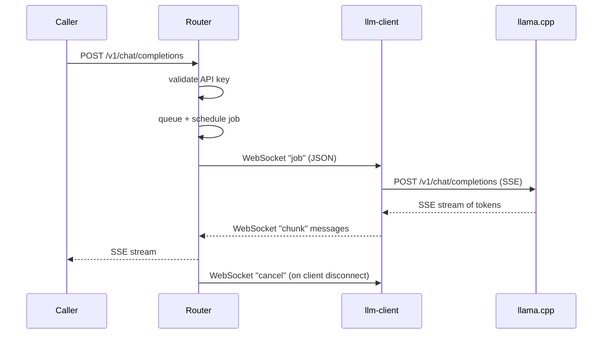

# llmesh

A lightweight, self-hosted LLM router that pools your llama.cpp instances into a single OpenAI/Anthropic-compatible API endpoint.

## Architecture

llmesh sits between callers (agents, tools, scripts) and your llama.cpp instances:

- **Router** — single API endpoint, pools all connected clients, handles authentication, request queuing, and affinity-based scheduling.
- **Client** — lightweight agent running on each machine with llama.cpp; connects to the router over WebSocket and dispatches inference jobs.

Callers only need to know the router URL. Inference runs on local llama.cpp nodes connected as clients over WebSocket.

### Request Flow



### Scheduling Strategy

The router dispatches requests to available clients using **client-centric affinity scheduling**:

1. **Owner affinity** — a request from user X prefers a client registered by user X
2. **Priority tier** — requests can be tagged `high`, `normal`, or `low`
3. **FIFO** — within the same tier, oldest first

Model aliases allow multiple clients serving different implementations of the same model to be addressed by a single logical name (e.g., `gpt-4o` → `unsloth/qwen3-30b` or `llama3.1:70b`).

---

## Deployment

The router and client run as separate Docker containers. One router instance can manage any number of clients.

### Prerequisites

- Docker and Docker Compose
- A llama.cpp server (HTTP mode) listening on each client machine

### 1. Router

The router runs on your server and exposes the API endpoint.

**Configure**

```bash
cp router/config.yaml.example router/config.yaml
```

Edit `router/config.yaml`:

```yaml
name: "llmesh"              # brand name shown on landing page and admin UI
host: "llmesh.example.com"  # public hostname (used in admin UI client setup instructions)
server:
  port: 53002
```

| Field | Required | Default | Description |
|-------|----------|---------|-------------|
| `name` | No | `llmesh` | Brand name shown on the landing page |
| `host` | No | `llmesh.example.com` | Public hostname — shown in admin UI when generating client config |
| `server.port` | No | `53002` | Port the router listens on |

**Start**

```bash
docker compose up -d
```

The `state.json` file (admin users, API keys, client tokens, model aliases) is created automatically on first run and persisted as a Docker volume.

**First-run setup**

Navigate to `http://[HOST]:[PORT]/admin`. On first run you are redirected to the setup wizard to create the initial admin account. All credentials are managed via this UI — there are no credentials in `config.yaml`.

From the admin dashboard you can:
- **Clients** → Create client tokens (needed to configure each `llm-client`)
- **API Keys** → Create API keys (needed by callers to authenticate requests)
- **Settings** → Configure model aliases, manage users

### 2. Client

The client runs on any machine with llama.cpp and connects back to the router. Run one client per machine.

**Configure**

```bash
cp client/config.yaml.example client/config.yaml
```

Edit `client/config.yaml`:

```yaml
router_url: "wss://llmesh.example.com/ws/client"  # WebSocket URL of the router
router_token: "ct-admin-xxxxxxxxxxxxxxxx"           # client token from router admin UI
max_concurrent: 4                                   # max simultaneous inference jobs
models:
  - name: "llama3.2:3b"
    endpoint: "http://host.docker.internal:8080"    # llama.cpp HTTP server
  - name: "unsloth/qwen3-30b-a3b"
    endpoint: "http://host.docker.internal:8081"
    # chat_template: "qwen2.5"   # optional: override model's built-in Jinja template
```

| Field | Required | Default | Description |
|-------|----------|---------|-------------|
| `router_url` | Yes | — | WebSocket URL of the router (`wss://` for TLS, `ws://` for plain) |
| `router_token` | Yes | — | Client token created in the router admin UI under **Clients** |
| `max_concurrent` | No | `4` | Maximum simultaneous inference jobs this client will handle |
| `models[].name` | Yes | — | Model name exactly as callers will request it |
| `models[].endpoint` | Yes | — | HTTP base URL of the llama.cpp server for this model |
| `models[].chat_template` | No | — | Override the model's built-in Jinja chat template (e.g. `"qwen2.5"`) |

> **Note:** The `router_token` must be created first in the router's admin UI under **Clients**. You can also download a pre-filled `config.yaml` directly from the Clients page.

**Start**

```bash
docker compose -f docker-compose.client.yml up -d
```

`host.docker.internal` resolves to the Docker host — use this to reach llama.cpp servers running on the same machine outside Docker.

---

## Build from source

```bash
git clone <repo> llmesh && cd llmesh
docker compose build
docker compose -f docker-compose.client.yml build
```

The router Dockerfile builds both the router binary and cross-platform client binaries (Linux AMD64/ARM64, macOS AMD64/ARM64) and places them in `/downloads` for easy distribution.

---

## API Endpoints

Replace `[HOST]` and `[PORT]` with your router's address (port default: `53002`). All `/v1/*` endpoints require `Authorization: Bearer <api-key>`.

### OpenAI-Compatible Chat Completions

```bash
curl -s https://[HOST]:[PORT]/v1/chat/completions \
  -H "Content-Type: application/json" \
  -H "Authorization: Bearer sk-your-key" \
  -d '{
    "model": "llama3.2:3b",
    "messages": [{"role": "user", "content": "Hello"}],
    "max_tokens": 256,
    "stream": true
  }'
```

### Anthropic Messages API

```bash
curl -s https://[HOST]:[PORT]/v1/messages \
  -H "Content-Type: application/json" \
  -H "x-api-key: sk-your-key" \
  -d '{
    "model": "llama3.2:3b",
    "max_tokens": 256,
    "messages": [{"role": "user", "content": "Hello"}],
    "stream": true
  }'
```

### OpenAI Responses API

```bash
curl -s https://[HOST]:[PORT]/v1/responses \
  -H "Content-Type: application/json" \
  -H "Authorization: Bearer sk-your-key" \
  -d '{
    "model": "llama3.2:3b",
    "input": "Hello"
  }'
```

### Model List

```bash
curl -s https://[HOST]:[PORT]/v1/models \
  -H "Authorization: Bearer sk-your-key"
```

Returns all models advertised by connected clients plus any configured aliases.

### Health Check

```bash
curl -s https://[HOST]:[PORT]/health
# {"status":"ok","version":"v0.1.0"}
```

### Admin Dashboard

```bash
curl -s -L https://[HOST]:[PORT]/admin
```

Browser-based UI for managing API keys, client tokens, model aliases, and users.

---

## Project Structure

```
llmesh/
├── router/                       # Router server
│   ├── config.yaml.example       # Config template
│   ├── Dockerfile
│   └── internal/
│       ├── api/                  # HTTP handlers + auth
│       ├── admin/                # Admin UI (Go templates, CSS/JS)
│       ├── hub/                  # WebSocket client registry
│       ├── queue/                # Priority request queue
│       ├── scheduler/            # Dispatch loop with affinity scheduling
│       ├── translate/            # OpenAI/Anthropic/Responses format translation
│       ├── correlation/          # Request→channel mapping for streaming
│       └── stats/                # In-memory token usage counters
├── client/                       # Client binary
│   ├── config.yaml.example       # Config template
│   ├── Dockerfile
│   └── internal/
│       ├── llamacpp/             # llama.cpp HTTP client (streaming, health checks)
│       ├── worker/               # Per-job handler with keep-alive
│       └── ws/                   # WebSocket connection + auto-reconnect
├── pkg/types/                    # Shared message types
├── docker-compose.yml            # Router service
└── docker-compose.client.yml     # Client service
```

---

## License

Private / self-hosted only.
