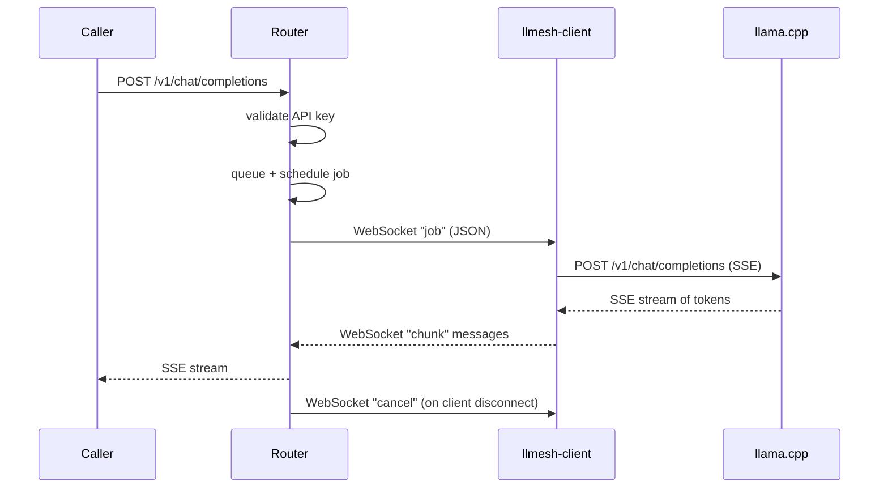

# llmesh

llmesh lets you share your local AI models across a team without anyone needing to know which machine is running what.

You point all your tools — agents, scripts, IDE plugins — at one URL. llmesh takes care of routing each request to whichever of your machines has the right model free. When one machine is busy, requests wait in a queue and go to the next available one. When a machine goes offline, the rest keep working.

It speaks the same API formats as OpenAI and Anthropic, so anything that already works with those services works with llmesh without changes. Everything runs on your own hardware. Nothing leaves your network.

---

## Design philosophy

**Thin and focused.** The router routes requests — it does not run inference, transform outputs, or call external services. One job, done reliably.

**Self-hosted by default.** No accounts to create, no telemetry, no external dependencies at runtime. State lives in an embedded SQLite database on disk.

**Protocol-compatible.** OpenAI and Anthropic wire formats are supported natively. If a tool works with those APIs, it works with llmesh.

**Simple to operate.** One binary per role, configuration in YAML, state in a single embedded SQLite file. No external database, no message broker, no service mesh required.

**Network-friendly.** Client machines connect *out* to the router over WebSocket — no inbound firewall rules or port forwarding needed on client machines.

---

## System requirements

### Router

The router does not run inference and is deliberately lightweight.

- **OS:** Linux or macOS (x86-64 or ARM64)
- **RAM:** ~64 MB minimum under load
- **CPU:** Any — the router is I/O-bound, not compute-bound
- **Runtime:** Docker (for the published image), or Go 1.26+ to build from source
- **Network:** Reachable by both callers and client machines; TLS termination recommended (e.g. via a reverse proxy)

### Client (llmesh-client)

The client is a small binary that runs alongside your llama.cpp instance.

- **OS:** Linux (x86-64, ARM64) or macOS (Intel, Apple Silicon)
- **RAM:** ~10 MB for the client binary itself — GPU/RAM requirements are determined by your llama.cpp models
- **Runtime:** Requires a running llama.cpp HTTP server (`llama-server`) on the same machine
- **Network:** Outbound HTTPS/WSS to the router only; no inbound ports required

---

## Architecture

llmesh sits between callers (agents, tools, scripts) and the machines that run your models:

- **Router** — the single API endpoint. Pools all connected workers, handles authentication, request queuing, and affinity-based scheduling. Runs no inference itself.
- **Client (llmesh-client)** — a worker that runs next to a llama.cpp server. Connects out to the router over WebSocket and dispatches inference jobs to local llama.cpp. Can also expose a local OpenAI-compatible HTTP endpoint for direct access from other processes on the same machine — these requests bypass the router but share the same concurrency pool as router jobs, with local requests taking priority.
- **Shim (llmesh-shim)** — a worker that bridges to an external HTTP API (OpenAI, Anthropic, any OpenAI-compatible server) or a local shell command, instead of llama.cpp. No GPU required. Connects to the router the same way a client does.

Callers only need to know the router URL. Workers connect *out* to the router, so no inbound ports are needed on worker machines.

### Request Flow



### Scheduling Strategy

The router dispatches requests to available clients using **client-centric affinity scheduling**:

1. **Owner affinity** — a client prefers requests submitted by the same user (user will have their own requests processed first)
2. **Priority tier** — requests can be tagged `high`, `normal`, or `low`
3. **FIFO** — within the same tier, oldest first

Model aliases allow multiple clients serving different implementations of the same model to be addressed by a single logical name (e.g., `gpt-4o` → `unsloth/qwen3-30b` or `llama3.1:70b`).

---

## Keys and your endpoint

llmesh uses two kinds of secret, for two different jobs. The prefix tells them apart.

| | **API key** | **Client token** |
|---|---|---|
| Looks like | `sk-alice-…` | `ct-alice-…` |
| Who uses it | People and apps **sending** requests (agents, scripts, SDKs) | Worker machines **doing** the inference (a GPU box, a cloud-API bridge) |
| Direction | App → router, over HTTPS | Worker → router, over WebSocket |
| Where it goes | The `Authorization` header of each API call | The `router_token` field of a worker's `config.yaml` |
| Created on | **API Keys** page | **Clients** page |

In short: an **API key (`sk-`)** lets someone ask llmesh for an answer; a **client token (`ct-`)** lets a machine offer to produce answers.

**Your API endpoint** is the single base URL your apps point at:

```
https://<your-router-host>/v1
```

That host is the `host` value from the router's `config.yaml`. The portal shows the exact URL at the top of the **API Keys** page, and the WebSocket URL workers use (`wss://<host>/ws/client`) at the top of the **Clients** page. Everything else hangs off the base URL — `/v1/chat/completions`, `/v1/messages`, `/v1/responses`, `/v1/models`.

```bash
curl https://<your-router-host>/v1/chat/completions \
  -H "Authorization: Bearer sk-yourkey" \
  -H "Content-Type: application/json" \
  -d '{"model":"llama3.2:3b","messages":[{"role":"user","content":"hi"}]}'
```

The in-app **Help** page (`/portal/help`) has the full reference: SDK snippets, the Anthropic and Responses endpoints, priority tiers, model aliases, tool calling, and the end-to-end request flow.

---

## Deployment

### 1. Router

The router runs on your server and exposes the API endpoint.

**Configure**

```bash
cp router/config.yaml.example router/config.yaml
```

Edit `router/config.yaml`:

```yaml
name: "llmesh"              # brand name shown on landing page and admin UI
host: "llmesh.example.com"  # public hostname (used in admin UI client setup instructions)
server:
  port: 53002
```

| Field | Required | Default | Description |
|-------|----------|---------|-------------|
| `name` | No | `llmesh` | Brand name shown on the landing page |
| `host` | No | `llmesh.example.com` | Public hostname — shown in admin UI when generating client config |
| `server.port` | No | `53002` | Port the router listens on |

**Start**

```bash
docker compose up -d
```

The state database (admin users, API keys, client tokens, aliases, audit log) is an embedded SQLite file created automatically on first run. It is mounted as a volume and persists across container restarts. A legacy `state.json` from older releases is imported automatically on first startup.

**First-run setup**

Navigate to `http://[HOST]:[PORT]/portal`. On first run you are redirected to the setup wizard to create the initial admin account. All credentials are managed via this UI — there are no credentials in `config.yaml`.

From the admin dashboard you can:
- **Clients** → Create client tokens (needed to configure each `llmesh-client` or `llmesh-shim`); also shows your worker connection URL and manages model aliases
- **API Keys** → Create API keys (needed by callers to authenticate requests); shows your API endpoint URL
- **Settings** → Manage users and configure upstream routers
- **Help** → Full API reference and setup guide

---

### 2. Client

The client runs on any machine with llama.cpp and connects back to the router. Run one client per machine.

**Configure**

```bash
cp client/config.yaml.example client/config.yaml
```

Edit `client/config.yaml`:

```yaml
router_url: "wss://llmesh.example.com/ws/client"  # WebSocket URL of the router
router_token: "ct-admin-xxxxxxxxxxxxxxxx"           # client token from router admin UI
# max_concurrent: 4                                 # optional — omit to auto-detect from llama.cpp slots
# local_api_addr: ":8089"                           # optional — local OpenAI-compatible endpoint (see below)
# auto_update: false                                # optional — poll hourly and self-update when idle
# remote_update: true                               # optional — honour router-pushed updates (default true)
models:
  - endpoint: "http://host.docker.internal:8080"    # name auto-detected from this endpoint
  - name: "unsloth/qwen3-30b-a3b"                    # or set the name explicitly
    endpoint: "http://host.docker.internal:8081"
    # chat_template: "qwen2.5"                      # optional: override model's built-in Jinja template
    # api_key: "sk-backend-key"                     # optional: sent as Authorization: Bearer to this endpoint
    # headers:                                      # optional: extra headers sent to this endpoint
    #   x-api-key: "gateway-token"
```

| Field | Required | Default | Description |
|-------|----------|---------|-------------|
| `router_url` | Yes | — | WebSocket URL of the router (`wss://` for TLS, `ws://` for plain) |
| `router_token` | Yes | — | Client token created in the router admin UI |
| `max_concurrent` | No | auto | Max simultaneous inference jobs across router and local requests combined. When omitted, auto-detected from llama.cpp's reported slot count (falls back to 1). Set explicitly to override. |
| `local_api_addr` | No | — | Bind address for a local OpenAI-compatible HTTP endpoint. When set, the client listens on this address and accepts `POST /v1/chat/completions` and `GET /v1/models` directly, routing to the appropriate llama.cpp backend without going through the router. Local requests share the same concurrency pool as router-dispatched jobs and take priority when slots are contested. Useful for other processes on the same host that want low-latency direct access. Example: `":8089"` |
| `auto_update` | No | `false` | Poll hourly for a newer binary and self-update when idle. No effect on dev builds or when the update endpoint is not HTTPS. |
| `remote_update` | No | `true` | Honour update requests pushed by the router (the admin UI update button). Set to `false` to deny the router the ability to swap this client's binary; the `auto_update` poll, being locally initiated, still applies. |
| `models[].name` | No | auto | Model name as callers will request it. When omitted, auto-detected from the endpoint's `/v1/models` at connect time. |
| `models[].endpoint` | Yes | — | HTTP base URL of the llama.cpp server for this model |
| `models[].chat_template` | No | — | Override the model's built-in Jinja chat template (e.g. `"qwen2.5"`) |
| `models[].api_key` | No | — | Sent to the endpoint as `Authorization: Bearer <key>` on every request. Use for backends that require authentication (vLLM, LM Studio, llama.cpp `--api-key`, hosted OpenAI-compatible servers). |
| `models[].headers` | No | — | Map of extra HTTP headers sent to the endpoint on every request (e.g. a gateway needing `x-api-key` or tenant routing). A header set here overrides one llmesh would otherwise send, including `Authorization`. |

The `router_token` must be created first in the router's admin UI under **Clients**.

**Start**

```bash
docker compose -f docker-compose.client.yml up -d
```

`host.docker.internal` resolves to the Docker host — use this to reach llama.cpp servers running on the same machine outside Docker.

---

### 3. Shim (optional)

Run a shim instead of (or alongside) a client when you want to expose an external API — OpenAI, Anthropic, any OpenAI-compatible server, or a local shell command — through the same router endpoint. No GPU required.

```bash
cp shim/config.yaml.example shim/config.yaml
```

Edit `shim/config.yaml` to point each model at a backend, then pass API keys via the environment:

```yaml
router_url: "wss://llmesh.example.com/ws/client"
router_token: "ct-admin-xxxxxxxxxxxxxxxx"   # client token, same as a client uses
models:
  - name: "gpt-4o"
    context_size: 128000
    backend:
      type: http
      url: "https://api.openai.com"
      format: openai           # or: anthropic
      auth_type: bearer
      auth_value: "${OPENAI_API_KEY}"
```

```bash
export OPENAI_API_KEY=sk-...
docker compose -f docker-compose.shim.yml up -d
```

The shim authenticates with a **client token** (`ct-`) exactly like `llmesh-client` — they are interchangeable from the router's point of view. Full field reference (HTTP backends, command adapters, the adapter protocol) is in the **Help** page and the `llmesh-shim(1)` man page.

---

## Build from source

```bash
git clone https://github.com/thomasteoh/llmesh && cd llmesh
docker compose build                                # router
docker compose -f docker-compose.client.yml build   # client
docker compose -f docker-compose.shim.yml build      # shim
```

---

## Run as a service

To have llmesh start automatically with the machine, run it under your init system.

### Docker

The compose files already set `restart: unless-stopped`, so a container started with `docker compose up -d` is restarted on failure **and** brought back after a reboot — provided the Docker daemon itself starts on boot:

```bash
sudo systemctl enable --now docker
```

No further configuration is needed for the Docker deployment.

### systemd (Linux)

For binaries built from source, run each role as a systemd service. The example below assumes the binary is installed at `/usr/local/bin/`, config under `/etc/llmesh/`, and a dedicated `llmesh` user. Create `/etc/systemd/system/llmesh-router.service`:

```ini
[Unit]
Description=llmesh router
After=network-online.target
Wants=network-online.target

[Service]
ExecStart=/usr/local/bin/llmesh-router -config /etc/llmesh/router.yaml -state /var/lib/llmesh/state.db
Restart=on-failure
RestartSec=5
User=llmesh
Group=llmesh
# Hardening — the router only needs to write its state directory
NoNewPrivileges=true
ProtectSystem=strict
ProtectHome=true
PrivateTmp=true
ReadWritePaths=/var/lib/llmesh

[Install]
WantedBy=multi-user.target
```

Then enable and start it (the `enable` is what makes it start on boot):

```bash
sudo systemctl daemon-reload
sudo systemctl enable --now llmesh-router
sudo systemctl status llmesh-router      # check it came up
journalctl -u llmesh-router -f           # follow logs
```

The **client** and **shim** units are identical except for the `ExecStart` line and description. Neither writes state, so drop the `-state` flag and the `ReadWritePaths` line:

| Role | `Description` | `ExecStart` |
|------|---------------|-------------|
| Router | `llmesh router` | `/usr/local/bin/llmesh-router -config /etc/llmesh/router.yaml -state /var/lib/llmesh/state.db` |
| Client | `llmesh client` | `/usr/local/bin/llmesh-client -config /etc/llmesh/client.yaml` |
| Shim | `llmesh shim` | `/usr/local/bin/llmesh-shim -config /etc/llmesh/shim.yaml` |

The shim reads API keys from the environment. Supply them with an `EnvironmentFile` so they stay out of the unit:

```ini
# in the [Service] section of llmesh-shim.service
EnvironmentFile=/etc/llmesh/shim.env     # e.g. OPENAI_API_KEY=sk-...
```

If `llama-server` also runs as a systemd unit on the same host, add `After=llama-server.service` to the client unit so the client starts after its backend.

### launchd (macOS)

On macOS, run each role as a launchd daemon. Create `/Library/LaunchDaemons/com.llmesh.router.plist`:

```xml
<?xml version="1.0" encoding="UTF-8"?>
<!DOCTYPE plist PUBLIC "-//Apple//DTD PLIST 1.0//EN" "http://www.apple.com/DTDs/PropertyList-1.0.dtd">
<plist version="1.0">
<dict>
    <key>Label</key>
    <string>com.llmesh.router</string>
    <key>ProgramArguments</key>
    <array>
        <string>/usr/local/bin/llmesh-router</string>
        <string>-config</string>
        <string>/etc/llmesh/router.yaml</string>
        <string>-state</string>
        <string>/var/lib/llmesh/state.db</string>
    </array>
    <key>RunAtLoad</key>
    <true/>
    <key>KeepAlive</key>
    <true/>
    <key>StandardOutPath</key>
    <string>/var/log/llmesh-router.log</string>
    <key>StandardErrorPath</key>
    <string>/var/log/llmesh-router.log</string>
</dict>
</plist>
```

Load it (loading a daemon in `/Library/LaunchDaemons` makes it start at boot):

```bash
sudo launchctl bootstrap system /Library/LaunchDaemons/com.llmesh.router.plist
sudo launchctl print system/com.llmesh.router      # check status
```

To stop and unload: `sudo launchctl bootout system/com.llmesh.router`.

For the **client** and **shim**, change `Label` (e.g. `com.llmesh.client`), the binary in `ProgramArguments`, and drop the `-state` argument. The shim's API keys go in an `EnvironmentVariables` dict:

```xml
    <key>EnvironmentVariables</key>
    <dict>
        <key>OPENAI_API_KEY</key>
        <string>sk-...</string>
    </dict>
```

---

## Testing

### Unit tests

```bash
go test -v -race -count=1 ./...
```

Run on every pull request. Includes race detection; coverage is uploaded to Codecov.

### End-to-end tests

```bash
go test -v -timeout 120s ./router/e2e/...
```

Spins up an in-process router with a mock llama.cpp client and exercises the full request path: HTTP → auth → queue → scheduler → WebSocket → response translation. Run on push to `main`.

---

## Releases

Docker images are published to the GitHub Container Registry on every GitHub release:

```
ghcr.io/thomasteoh/llmesh:<version>
```

Tags generated per release:

| Tag | Example | Description |
|-----|---------|-------------|
| `{{version}}` | `0.1.0` | Exact release version |
| `{{major}}.{{minor}}` | `0.1` | Major.minor track |
| `latest` | `latest` | Most recent stable release (not applied to release candidates) |

To use the published image instead of building from source, replace the `build:` block in `docker-compose.yml`:

```yaml
services:
  llmesh-router:
    image: ghcr.io/thomasteoh/llmesh:latest
```

---

## API Endpoints

Replace `[HOST]` and `[PORT]` with your router's address (port default: `53002`).

| Endpoint | Description |
|----------|-------------|
| `POST /v1/chat/completions` | OpenAI chat completions (streaming + non-streaming) |
| `POST /v1/messages` | Anthropic messages API |
| `POST /v1/responses` | OpenAI Responses API |
| `GET /v1/models` | List available models (OpenAI-compatible) |
| `GET /v1/models/slots` | llmesh-specific: models the key can currently get a slot on, with available slot counts |
| `GET /health` | Health check |
| `GET /portal` | Admin dashboard |

All `/v1/*` endpoints require `Authorization: Bearer <api-key>`.

`GET /v1/models/slots` returns only the models the calling key can obtain a slot on **right now**, so it reflects live capacity and per-client owner-slot reservations rather than the full catalogue. Each entry reports `available_slots` (slots the key could acquire immediately), `total_slots` (the key's usable capacity ceiling), `context_window`, and any `aliases` that resolve to the model:

```json
{
  "object": "list",
  "data": [
    { "model": "llama3", "available_slots": 3, "total_slots": 4, "context_window": 8192, "aliases": ["fast"] }
  ]
}
```

---

## Project Structure

```
llmesh/
├── router/                       # Router server
│   ├── config.yaml.example       # Config template
│   ├── Dockerfile
│   └── internal/
│       ├── api/                  # HTTP handlers + auth
│       ├── admin/                # Admin UI
│       ├── hub/                  # WebSocket client registry
│       ├── queue/                # Priority request queue
│       ├── scheduler/            # Dispatch loop
│       └── translate/            # OpenAI/Anthropic/Responses format translation
├── client/                       # Client binary (llama.cpp worker)
│   ├── config.yaml.example       # Config template
│   ├── man/                      # llmesh-client(1) man page
│   ├── Dockerfile
│   └── internal/
│       ├── llamacpp/             # llama.cpp HTTP client
│       ├── localapi/             # Local OpenAI-compatible HTTP endpoint
│       ├── worker/               # Per-job handler
│       └── ws/                   # WebSocket connection + reconnect
├── shim/                         # Shim binary (HTTP API / command-adapter worker)
│   ├── config.yaml.example       # Config template
│   ├── man/                      # llmesh-shim(1) man page
│   └── internal/                 # Backends (http, command) + WebSocket connection
├── pkg/
│   ├── types/                    # Shared message types
│   └── wsclient/                 # Shared WebSocket client (used by client + shim)
├── docker-compose.yml            # Router service (build from source)
├── docker-compose.client.yml     # Client service (build from source)
└── docker-compose.shim.yml       # Shim service (build from source)
```

---

## Contributing

See [CONTRIBUTING.md](CONTRIBUTING.md).

## License

[MIT](LICENSE)
